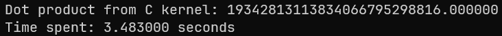
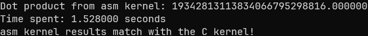
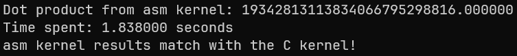

# mp2_lbyarch

#### Execution Time of Assembly and C Kernels for 20 Runs

### Debug Build Results:

| Asm Kernel | C Kernel  |
| ---------- | --------- |
| 1.814000s  | 3.093000s |
| 1.119000s  | 2.475000s |
| 1.120000s  | 2.383000s |
| 1.111000s  | 2.449000s |
| 1.111000s  | 2.384000s |
| 1.774000s  | 3.193000s |
| 1.134000s  | 2.400000s |
| 1.191000s  | 2.443000s |
| 1.130000s  | 2.590000s |
| 1.130000s  | 2.441000s |
| 1.234000s  | 2.389000s |
| 1.226000s  | 2.529000s |
| 1.209000s  | 2.396000s |
| 1.177000s  | 2.465000s |
| 1.125000s  | 2.645000s |
| 1.855000s  | 2.891000s |
| 1.203000s  | 2.503000s |
| 1.153000s  | 2.460000s |
| 1.225000s  | 2.482000s |
| 1.206000s  | 2.434000s |

- Average Asm Kernel Time: 1.26235s
- Average C Kernel Time: 2.55225s

We can see that the assembly kernel consistently outperforms the C kernel in execution time across all 20 runs.
Running 2x faster on average. This may be due to a more efficient use of the CPU instructions and not needing to access the memory as often.
For example the C kernel function

```
float sdot(float* a, float* b, int n) {
	float dprod = 0;
	for (int i = 0; i < n; i++) {
		dprod += a[i] * b[i];
	}

	return dprod;
}
```

may require multiple memory accesses, aside from accessing the arrays, for each iteration of the loop, whereas an assembly implementation could potentially
load multiple values into registers and perform operations directly on them while only requiring memory access on the arrays themselves, reducing the number of memory accesses required.

#### C Kernel Output Image (Debug Build)



#### ASM Kernel Output Image (Debug Build)



### Release Build Results:

| Asm Kernel | C Kernel  |
| ---------- | --------- |
| 1.304000s  | 1.256000s |
| 1.260000s  | 1.241000s |
| 1.257000s  | 1.242000s |
| 1.261000s  | 1.243000s |
| 1.248000s  | 1.248000s |
| 1.461000s  | 1.241000s |
| 1.990000s  | 1.981000s |
| 1.290000s  | 1.251000s |
| 1.869000s  | 1.961000s |
| 1.407000s  | 1.223000s |
| 1.278000s  | 1.234000s |
| 1.257000s  | 1.245000s |
| 1.241000s  | 1.236000s |
| 1.266000s  | 1.220000s |
| 1.258000s  | 1.228000s |
| 1.332000s  | 1.249000s |
| 1.270000s  | 1.243000s |
| 1.245000s  | 1.236000s |
| 1.275000s  | 1.296000s |
| 1.907000s  | 1.966000s |

- Average Asm Kernel Time: 1.38145
- Average C Kernel Time: 1.346333333

When testing the code in the Release Build, the performance between the two kernels became much closer.
With the C kernel very slightly outperforming the assembly kernel on average. This is likely due to the optimizations performed by the C compiler in Release mode.

#### C Kernel Output Image (Release Build)


#### ASM Kernel Output Image (Release Build)


